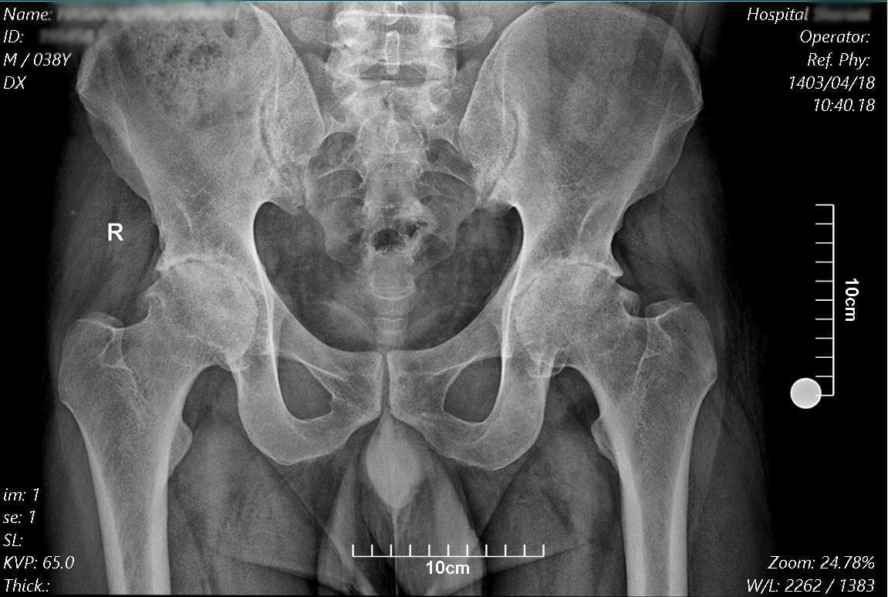

# health-xray-image-calibration

## 📖 Description

This project provides a web-based tool to calibrate X-ray images. It allows users to upload an X-ray 📤, select a reference circle (17mm diameter) ⚪, and rescale the image for accurate measurements 📏.

## ✨ Features

*   **Image Upload:** Allows users to upload X-ray images in common formats (e.g., JPEG, PNG).
*   **Circle Detection:** Implements a circle detection method by OpenCV or clicking three points on the circumference of a reference circle with a known diameter (17mm).
*   **Calibration:** Calculates the scaling factor based on the detected circle and rescales the X-ray image.
*   **Display:** Displays the calibrated X-ray image.

## 💻 Usage

1.  **Upload Image:** Click on the "Load X-ray Image" button to upload your X-ray image.
2.  **Select Circle:** Click on three points on the circumference of the 17mm reference circle in the image.
3.  **Calibrate:** Click the "Calibrate" button. The image will be rescaled.
4.  **View Calibrated Image:** The calibrated image will be displayed.

## 🖼️ Example Image

*Pelvic X-ray image used for calibration with a 17mm reference circle.*

## 📂 File Descriptions

*   **cornerstone-medical-image-scale.html:** The main HTML file containing the structure of the web page, including the image viewer and calibration tools.
*   **Pelvic_Xray_Sample.jpg:** Sample X-ray image (pelvis) used for testing and demonstration purposes.

## ⚠️ Known Issues

*   Calibration accuracy depends on the precision of the three points selected on the reference circle.

## 📜 License

This project is licensed under the MIT License.

## 🤝 Contribute
Contributions are welcome! Feel free to open issues or submit pull requests. 🚀

